# splunk-bots-hunts

[](https://github.com/JacobRHess/splunk-bots-hunts/actions/workflows/hunts.yml)
[](https://github.com/JacobRHess/splunk-bots-hunts/actions/workflows/codeql.yml)
[](https://www.python.org/downloads/release/python-3130/)
[](LICENSE)

**A Boss of the SOC v3 investigation you can run, and that proves itself in CI.**

Most BOTS v3 writeups are a blog post with SPL screenshots: static, one question at a time, impossible to tell if they still hold. This one is a repo. On every commit, CI boots a Splunk container, replays the evidence as fixtures over HEC, runs every hunt and asserts its answer, runs every detection and asserts it fires on malicious data while staying silent on benign, and validates the installable app with `btool`. If a finding rots or a rule stops firing, the build breaks.

Six scenarios follow one intrusion across the telemetry, not twenty disconnected questions: a compromised AWS account (01), the laptop behind it (02), a browser cryptominer on that laptop (03), a fileless PowerShell implant on a second host (04), that same `fyodor` identity reused against Azure AD from a Hong Kong VPS (05), and what the stolen cloud accounts then did inside Office 365 (06). Each scenario is a documented hunt (the question, the SPL, the pivots, the ATT&CK techniques) that then ships the detection it would have written, tested against both malicious and benign fixtures and packaged as an installable Splunk app.

## The intrusion

```mermaid
flowchart LR
    classDef cloud fill:#1f6feb22,stroke:#58a6ff,color:#c9d1d9;
    classDef host fill:#3fb95022,stroke:#3fb950,color:#c9d1d9;

    A["01 · AWS recon<br/>bstoll, no MFA<br/>T1078.004"]:::cloud
    B["02 · BSTOLL-L logons<br/>remote compromise ruled out"]:::host
    C["03 · Coinhive miner<br/>browser foothold<br/>T1496"]:::host
    D["04 · PowerShell implant<br/>FYODOR-L, registry persistence<br/>T1059.001 / T1053.005"]:::host
    E["05 · Azure AD sign-ins<br/>fyodor from HK VPS<br/>T1078.004 / T1110.003"]:::cloud
    F["06 · O365 account abuse<br/>bgist shares a lure, fyodor edits mailboxes<br/>T1080 / T1098 / T1531"]:::cloud

    A -->|how were the keys stolen| B
    B -->|browser was the weak point| C
    C -. separate foothold .-> D
    D -->|same identity reused| E
    E -->|same accounts, now in O365| F
```



`bstoll` ties scenarios 01-03; `fyodor` ties 04-06, with `bgist` carrying the cloud accounts from 05 into 06. Two compromised users, several hosts and cloud tenants, one timeline on 2018-08-20.

## Hunts and detections

A detection answers "did this happen?" A hunt answers "what happened?" Each scenario starts as a hunt: a documented investigation of a piece of the BOTSv3 intrusion. It then ships the detection that investigation would have written, as deployable Splunk content. The hunts assert a known answer in CI; the detections assert they fire on the malicious slice and stay silent on benign data.

## Repo layout

```
scenarios/<id>-<slug>/
├── README.md           narrative write-up
├── hunts/*.spl         one SPL per documented hunt
├── detections.yaml     deployable correlation searches (fire/silent fixture test)
├── dashboards/*.xml    Splunk dashboard XML
├── fixtures/*.jsonl    fixture event slice per index (for CI)
├── answers.yaml        { hunts: [{ file, question, expected, field }] }
└── attack.yaml         { techniques: [{ id, name }] }
```

Generated, committed artifacts:

```
splunk_app/froth_bots_hunts/   installable Splunk app (dashboards + scheduled detections)
docs/index.html                static HTML report (GitHub Pages ready)
docs/attack-navigator-layer.json  MITRE ATT&CK Navigator layer
```

The full BOTSv3 dataset stays out of git. Fixtures committed alongside each hunt are tiny event slices, just enough to exercise the SPL in CI.

## Splunk app

`splunk_app/froth_bots_hunts/` is generated from the scenario sources by `harness/build_splunk_app.py`. It bundles every scenario dashboard as a view and every `detections.yaml` entry as a scheduled, ATT&CK-annotated saved search. Copy it to `$SPLUNK_HOME/etc/apps/` and restart, or upload it via Manage Apps. CI ingests the fixtures and runs `harness/run_detections.py` to assert each detection's `fixture_expect` (`fires` or `silent`), so the shipped rules can't rot.

The `docs/attack-navigator-layer.json` layer uploads directly to the [ATT&CK Navigator](https://mitre-attack.github.io/attack-navigator/) ("Open Existing Layer"), scored by scenario coverage.

## Local development

Prereqs: Docker Desktop (or native Splunk), Python 3.13, [uv](https://github.com/astral-sh/uv).

```powershell
uv sync
docker compose -f docker/compose.yml up -d
```

Splunk Web is at <http://localhost:8000>. The dev admin password is `changeme` (set `SPLUNK_PASSWORD` env to override). The first time, install the BOTSv3 app via Manage Apps → Install from file; the bundle lives at <https://github.com/splunk/botsv3>.

Run all documented hunts against the running Splunk, then assert the detections fire (or stay silent):

```powershell
uv run python harness/run_hunts.py
uv run python harness/run_detections.py
```

Regenerate the committed artifacts (coverage page, HTML report, ATT&CK Navigator layer, Splunk app):

```powershell
uv run python harness/attack_aggregate.py    # docs/attack-coverage.md (gitignored)
uv run python harness/build_report.py        # docs/index.html
uv run python harness/build_attack_layer.py  # docs/attack-navigator-layer.json
uv run python harness/build_splunk_app.py    # splunk_app/froth_bots_hunts/
```

The HTML report is a single self-contained file. Serve it locally or publish it with GitHub Pages (Settings → Pages → `main` / `docs`).

## CI

Two workflows, both on push and PR:

`hunts.yml` runs in two jobs:

- **lint** (~1 min): ruff, mypy strict, bandit security linting, pytest with coverage gate (50% minimum on pure-Python paths), pip-audit against the resolved lockfile.
- **validate** (~3 min, runs after lint passes): boots Splunk in Docker, ingests every scenario's fixtures via HEC, runs every hunt's SPL via REST, asserts each answer.

`codeql.yml` runs CodeQL static analysis for Python on push, PR, and weekly.

All third-party actions are SHA-pinned. Workflows declare least-privilege `permissions:` blocks. Concurrency groups cancel in-progress runs when a branch is updated.

## Security notes

- Credentials in the repo are dev-only: `changeme`/`Chang3me!` passwords, fixed HEC token `00000000-...`. Never reuse them outside CI or a local sandbox.
- The Python harness disables TLS verification (`verify=False`) because the Splunk Docker image presents a self-signed cert on its mgmt and HEC endpoints. Bandit's `B501` warning is suppressed for this reason and the suppression is scoped via `pyproject.toml`.
- Coverage on the HTTP-IO functions is excluded via `pragma: no cover`; those paths are exercised end-to-end by the `validate` CI job against a real Splunk container, not unit-tested with mocks.
- `pip-audit` runs on every PR (with `--skip-editable`, since the local package is installed editable). Vulnerability findings break the build.
- Hunt fixtures are slices of BOTSv3 public data. Nothing in the repo contains real customer or production telemetry.

## Status

Six scenarios shipped: 25 hunts and 9 deployable detections across 19 ATT&CK techniques. The first three follow one thread: a compromised `bstoll` AWS account (01), ruling out remote endpoint compromise on `BSTOLL-L` (02), and finding the browser cryptojacking that put attacker JavaScript on that same laptop (03). Scenario 04 turns to a second compromised host, `FYODOR-L`, running a fileless PowerShell implant. Scenario 05 follows that same `fyodor` identity off the endpoint and into Azure AD, where the credentials sign in from a Hong Kong VPS. Scenario 06 stays in the cloud, using the O365 management log to show what the stolen `bgist` and `fyodor` accounts did once inside: `bgist` exposes a `.lnk` lure through an anonymous sharing link from the same Hong Kong IP, and `fyodor` runs `Set-Mailbox` against colleagues, disabling one. A generated HTML report at `docs/index.html` indexes every scenario, hunt, detection, and ATT&CK technique. Adding more as the dataset gets worked through.

Hunts are written with `index=*` so they run against either the real `index=botsv3` or the CI fixture index; the generated detections are scoped to `index=botsv3` for deployment.
